# 🚀 Complete Setup Guide

This guide will walk you through setting up your project for both local development and automated CI/CD deployment.

## 📋 Prerequisites

Before starting, ensure you have:
- ✅ Node.js (>= 18.0) installed
- ✅ Git installed
- ✅ Accounts for: GitHub, Vercel, Supabase, Cloudflare (optional)

## 🗄️ Supabase Setup

Before setting up your local environment, you'll need to create a Supabase project and get your credentials.

### Step 1: Create a Supabase Account and Project

1. **Sign up for Supabase**
   - Go to [Supabase](https://supabase.com)
   - Sign up for a free account (or sign in if you already have one)

2. **Create a New Project**
   - Click "New Project" in your dashboard
   - Fill in:
     - **Name**: Your project name
     - **Database Password**: Choose a strong password (save this securely!)
     - **Region**: Choose the closest region to your users
     - **Pricing Plan**: Select "Free" for personal projects

3. **Wait for Project Setup**
   - Supabase will provision your database (takes 1-2 minutes)
   - You'll see a notification when it's ready

### Step 2: Get Your Supabase Credentials

1. **Get Project URL**
   - Go to your project dashboard
   - Navigate to **Settings** → **Data API**
   - Copy the **Project URL**: `https://xxxxxxxxxxxxx.supabase.co`

2. **Get API Keys**
   - Go to **Settings** → **API Keys**
   - You'll find:
     - **Publishable key** (anon/public key): A long string starting with `eyJ...`
       - This is safe to use in browsers with Row Level Security (RLS) enabled
       - This is your `NEXT_PUBLIC_SUPABASE_ANON_KEY`
     - **Secret keys** (service_role key): Another long string (⚠️ Keep this secret! Click "Reveal" to see it)
       - Use only in backend/server-side code
       - This is your `SUPABASE_SERVICE_ROLE_KEY`

3. **Get Your Project ID**
   - Go to **Settings** → **General**
   - Find your **Reference ID** (this is your Project ID)
   - Or extract it from your Project URL: `https://app.supabase.com/project/[PROJECT_ID]`

4. **Get Access Token (for CI/CD)**
   - Go to [Account Settings → Access Tokens](https://supabase.com/dashboard/account/tokens)
   - Click "Generate new token"
   - Give it a name (e.g., "GitHub Actions")
   - Copy the token (you won't be able to see it again!)

### Step 3: Install Supabase CLI (Optional)

You have two options for development:

**Option A: Use Remote Supabase (Recommended, No Docker Required)**
- Just configure `.env.local` with your remote project credentials
- No CLI or Docker needed
- Migrations can be run via Supabase Dashboard or CLI

**Option B: Use Local Supabase (Requires Docker)**
- Install Docker Desktop: https://docs.docker.com/desktop
- Install Supabase CLI: `npm install -g supabase`
- Run `npx supabase start` to start local services

**For most users, Option A (remote Supabase) is recommended.** You only need Docker if you want to develop completely offline.

---

## 🏠 Local Development Setup

### Step 1: Install Dependencies

```bash
npm install
```

### Step 2: Set Up Environment Variables

```bash
# Copy the example environment file
cp env.example .env.local
```

**Edit `.env.local` with your Supabase credentials:**

```bash
# Get these from Supabase Dashboard:
# Project URL: Settings → Data API
# Publishable key: Settings → API Keys → Publishable key
# Service role key: Settings → API Keys → Secret keys → service_role (click Reveal)
NEXT_PUBLIC_SUPABASE_URL=https://xxxxxxxxxxxxx.supabase.co
NEXT_PUBLIC_SUPABASE_ANON_KEY=eyJhbGciOiJIUzI1NiIsInR5cCI6IkpXVCJ9...  # Publishable key
SUPABASE_SERVICE_ROLE_KEY=eyJhbGciOiJIUzI1NiIsInR5cCI6IkpXVCJ9...  # Service role key (Optional, backend only)

# For local development
NEXT_PUBLIC_SITE_URL=http://localhost:3000
```

**Where to find these values:**
- `NEXT_PUBLIC_SUPABASE_URL`: Supabase Dashboard → Settings → Data API → Project URL
- `NEXT_PUBLIC_SUPABASE_ANON_KEY`: Supabase Dashboard → Settings → API Keys → Publishable key
- `SUPABASE_SERVICE_ROLE_KEY`: Supabase Dashboard → Settings → API Keys → Secret keys → service_role key (click "Reveal" to see it) (⚠️ Keep this secret!)

**Note:** The `SUPABASE_SERVICE_ROLE_KEY` is optional for local development but may be needed for admin operations. Keep it secure and never commit it to git!

### Step 3: Run Database Migrations

Apply the initial database schema to your Supabase project:

```bash
# Using Supabase CLI (recommended)
npx supabase db push --project-ref your-project-id

# Or if you've linked your project
npx supabase db push
```

**Alternative: Run migrations via Supabase Dashboard**
- Go to your Supabase project dashboard
- Navigate to **SQL Editor**
- Copy and paste the contents of `supabase/migrations/20240101000001_initial_schema.sql`
- Click "Run"

### Step 4: Run Local Setup Script (Optional)

For an automated setup:

```bash
./scripts/setup-local.sh
```

This script will:
- Create `.env.local` if it doesn't exist
- Install dependencies
- Optionally set up local Supabase (requires Docker) - **or you can use remote Supabase (no Docker needed)**

**Note:** You don't need Docker to use Supabase! The script will:
- Use your **remote Supabase project** by default (configured via `.env.local`)
- Only use Docker if you choose to run Supabase locally (optional)

### Step 5: Start Development Server

```bash
npm run dev
```

Visit `http://localhost:3000` to see your app!

**Verify Supabase Connection:**
- The app should connect to your Supabase project automatically
- Check the browser console for any connection errors
- If you see errors, verify your `.env.local` credentials are correct

---

## ☁️ CI/CD Setup (Automated Deployment)

The project uses a simplified CI/CD approach:
- ✅ **Terraform** manages Vercel project connection and environment variables
- ✅ **GitHub Actions** runs Supabase migrations automatically
- ✅ **Vercel** auto-deploys on every push (via GitHub integration managed by Terraform)

### Step 1: Set Up Infrastructure with Terraform

The Terraform configuration will:
- Link your Vercel project to GitHub (for automatic deployments)
- Configure all environment variables in Vercel
- Set up DNS and email routing
- Configure Supabase integration

**Get Required API Tokens:**

1. **Vercel API Token**
   - Go to [Vercel Account Settings](https://vercel.com/account/tokens)
   - Create a new token
   - Copy the token

2. **Supabase Access Token**
   - Go to [Supabase Dashboard](https://supabase.com/dashboard/account/tokens)
   - Generate new token
   - Copy the token

3. **Supabase Project Credentials**
   - **Project URL**: Go to [Supabase Dashboard → Settings → Data API](https://supabase.com/dashboard/project/_/settings/api) → Copy the Project URL
   - **Publishable key (anon)**: Go to [Supabase Dashboard → Settings → API Keys](https://supabase.com/dashboard/project/_/settings/api) → Copy the Publishable key
   - **Service role key**: Same page → Secret keys → Click "Reveal" to see the service_role key (⚠️ Keep secret!)
   - **Project ID**: Go to [Supabase Dashboard → Settings → General](https://supabase.com/dashboard/project/_/settings/general) → Reference ID
   - **Access Token**: [Account Settings → Access Tokens](https://supabase.com/dashboard/account/tokens) → Generate new token

**Configure Terraform:**

1. Copy the example variables file:
   ```bash
   cp terraform/terraform.tfvars.example terraform/terraform.tfvars
   ```

2. Edit `terraform/terraform.tfvars` with your values

3. Run Terraform:
   ```bash
   cd terraform
   terraform init
   terraform plan  # Review what will be created
   terraform apply # Create infrastructure
   ```

This will automatically:
- Connect your Vercel project to GitHub
- Set up all environment variables in Vercel
- Configure DNS and domains

### Step 2: Configure GitHub Secrets for Migrations

Go to your GitHub repository → **Settings** → **Secrets and variables** → **Actions**

Add these secrets (only for Supabase migrations):

| Secret Name | Description | Where to Get It |
|------------|-------------|-----------------|
| `SUPABASE_ACCESS_TOKEN` | Supabase access token for CLI | [Supabase Dashboard](https://supabase.com/dashboard/account/tokens) |
| `SUPABASE_PROJECT_ID` | Your Supabase project ID | Supabase project settings |

**Note:** Vercel environment variables are managed by Terraform, not GitHub secrets.

### Step 3: Test the Deployment

1. Push to your `main` branch:
   ```bash
   git add .
   git commit -m "Initial setup"
   git push origin main
   ```

2. What happens automatically:
   - **GitHub Actions** runs Supabase migrations
   - **Vercel** (connected via Terraform) automatically deploys your app
   - Environment variables are already configured in Vercel by Terraform

3. Verify:
   - Check GitHub Actions tab for migration status
   - Check Vercel dashboard for deployment status
   - Visit your deployed URL

---

## 🔄 How the Automated Flow Works

```mermaid
sequenceDiagram
  participant Dev as Developer
  participant GH as GitHub
  participant T as Terraform
  participant V as Vercel
  participant S as Supabase

  Dev->>GH: Push commits
  GH->>GH: Trigger CI/CD workflow
  GH->>S: Run database migrations
  S->>S: Update schemas
  GH->>V: Auto-deploy (via GitHub integration)
  V->>V: Build + create deployment
  V->>S: Connect using env vars (from Terraform)
  
  Note over T: One-time setup:<br/>Terraform links<br/>Vercel ↔ GitHub<br/>and sets env vars
```



### What Happens on Each Push:

1. **GitHub Actions Workflow Triggers** (runs Supabase migrations)
   - Checks out code
   - Installs dependencies
   - Sets up Supabase CLI
   - Runs database migrations automatically

2. **Database Migrations Run**
   - Pushes all migrations from `supabase/migrations/` to your Supabase project
   - Ensures schema is always up to date

3. **Vercel Auto-Deployment**
   - Vercel detects the push (via GitHub integration set up by Terraform)
   - Builds your Next.js app
   - Deploys to production
   - Uses environment variables configured by Terraform

### Initial Setup (One-Time):

1. **Terraform Configuration**
   - Links Vercel project to GitHub repository
   - Sets up all environment variables in Vercel
   - Configures DNS and domains
   - Sets up email routing

---

## 🛠️ Useful Commands

### Local Development

```bash
npm run dev              # Start development server
npm run build            # Build for production
npm run lint             # Run linting
npm run type-check       # TypeScript type checking

# Database commands
npm run db:reset         # Reset local database
npm run db:migrate       # Run migrations
npm run db:seed          # Seed database
```

### CI/CD Management

```bash
# Manual workflow triggers (via GitHub UI)
# - Go to Actions → Deploy to Supabase → Run workflow (for manual migrations)

# Infrastructure management
cd terraform
terraform plan    # Preview infrastructure changes
terraform apply   # Apply infrastructure changes
terraform destroy # Remove infrastructure (use with caution)
```

---

## 🚨 Troubleshooting

### Local Development Issues

**Problem:** Can't find Supabase credentials
- **Solution:** 
  - Go to [Supabase Dashboard](https://supabase.com/dashboard)
  - Select your project
  - **Project URL**: Navigate to **Settings** → **Data API** → Copy the Project URL
  - **Publishable key (anon)**: Navigate to **Settings** → **API Keys** → Copy the Publishable key
  - **Service role key**: Navigate to **Settings** → **API Keys** → Secret keys → Click "Reveal" to see the service_role key
  - Make sure you're using the correct project!

**Problem:** Supabase not connecting in local app
- **Solution:** 
  - Verify `.env.local` exists and has correct credentials
  - Check that `NEXT_PUBLIC_SUPABASE_URL` starts with `https://`
  - Check that `NEXT_PUBLIC_SUPABASE_ANON_KEY` is the full key (starts with `eyJ...`)
  - Restart your dev server after changing `.env.local`
  - Check browser console for specific error messages

**Problem:** Database migrations failing
- **Solution:** 
  - Ensure you have the correct Project ID
  - Verify your Supabase Access Token is valid
  - Check that the migration files exist in `supabase/migrations/`
  - Try running: `npx supabase db push --project-ref your-project-id`

**Problem:** "Project not found" error
- **Solution:**
  - Double-check your Project ID (Reference ID in Supabase dashboard)
  - Make sure you're logged in: `npx supabase login`
  - Verify your Access Token has the correct permissions

**Problem:** Supabase CLI not found
- **Solution:** 
  - Install globally: `npm install -g supabase`
  - Or use npx: `npx supabase <command>`
  - Or add to your project: `npm install -D supabase`

### CI/CD Issues

**Problem:** GitHub Actions failing with "SUPABASE_ACCESS_TOKEN not found"
- **Solution:** Add `SUPABASE_ACCESS_TOKEN` and `SUPABASE_PROJECT_ID` secrets in GitHub repository settings

**Problem:** Vercel deployment failing
- **Solution:** 
  1. Verify Terraform successfully linked Vercel to GitHub
  2. Check Vercel dashboard for detailed error logs
  3. Ensure environment variables are set in Terraform configuration

**Problem:** Environment variables not set in Vercel
- **Solution:** Run `terraform apply` to sync environment variables from your `terraform.tfvars` to Vercel

---

## 📚 Next Steps

1. **Customize Your App**
   - Edit `app/page.tsx` for your home page
   - Modify components in `app/components/`
   - Update database schema in `supabase/migrations/`

2. **Add Features**
   - Create new database tables
   - Add new API routes
   - Implement authentication flows

3. **Deploy**
   - Push to `main` branch
   - Watch GitHub Actions deploy automatically
   - Visit your live site!

---

## 🆘 Need Help?

- Check the [main README](README.md) for more details
- Review [Architecture docs](ARCHITECTURE.md) for system overview
- Open an issue in the repository for bugs
- Check GitHub Actions logs for deployment errors

---

**Happy coding! 🚀**

